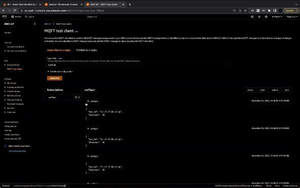
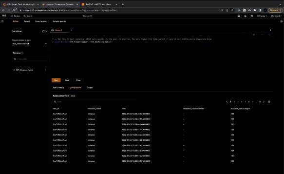
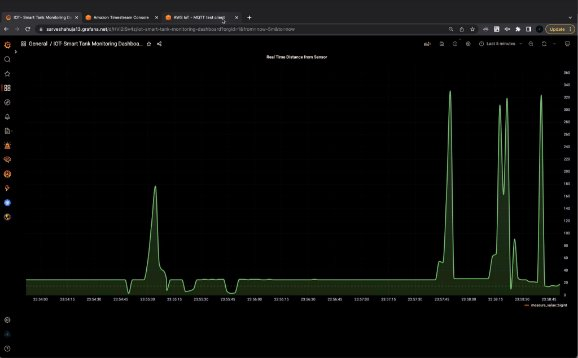

**Smart-Tank With Fluid Level Dashboard** 
 
By :**SARVESH AHUJA**

# **TABLE OF CONTENTS**

**CHAPTERS  CONTENTS** 

1.[ABSTRACT](#1.-ABSTRACT)\
2.[INTRODUCTION](#INTRODUCTION)\
3.REQUIREMENT ANALYSIS\
4.ARCHITECTURE & DESIGN\
5.IMPLEMENTATION\
6.RESULTS AND DISCUSSION\
7.CONCLUSION & FUTURE ENHANCEMENT\
8.REFERENCES\

# 1. ABSTRACT

**1.1  Background/Reasons for the project :**

Targeting all the large- and small-scale industries, detecting the liquid levels remains a bit challenging. Manual supervision by noting down the readings three or four times a day calls in for a lot of laborious work. On top of that, you have no guarantee if the readings are accurate or not.

Keeping in mind all the issues faced in the industry, IoT has come up with an advanced concept of identifying liquid levels. Also, the market value for Industrial IoT is expected to reach $263.4 billion by the year 2027, which possesses a highly influential factor of accepting a smart solution to measure the liquid levels in many industries.

Industrial tanks comprise of different shapes, sizes, orientations, and materials, which might hinder the processing of mainstream technologies. However, the Internet of Things utilizes the capabilities of sensor devices that are sturdy enough to provide consistent services in all kinds of weather.

**1.2:  Our Approach:**

A real time dashboard has been designed for monitoring the fluid level in an industrial tank. This is an important problem as understanding the health of chemical/toxic substances can help prevent enormous loss of money and time for companies/industries.

A simple IOT Application has been designed using various Software as a service and Platform as a Service provided by Amazon Web Services(AWS).

Using MQTT(Built on top of UDP protocol) a **Microcontroller** sends ultrasonic distance data to I**OT core** service (on AWS cloud ).This sets up the Pub-Sub Model. Role permissions are set in order to allow the service to read/write onto AWS **TimestreamDB** Database.Other security permissions( Roles )are also set in order to allow external Tool **Grafana** to query and read the TimestreamDB Table values over HTTP APIs.

A dashboard is configured on Grafana cloud to view the data as desired.

<a name="INTRODUCTION">
 
#2. INTRODUCTION

->**Scenario Description:**

- A tank level monitoring system possesses reliable software and hardware which allows clients to perform industrial operations at a much faster pace along with accurate results. It is equipped with a sensor devices, which capture data in real-time and send it on a secured cloud platform for further analysis.
- Thus, using a sensor-enabled technology to monitor your tank levels provides greater business benefits than continuing with the traditional means. It offers automation and enhances the capabilities of the assets (storage tanks) to perform better.
- Also, the solution is easy to install by suspending the sensors through a rod on an open tank or drilling a hole over the lids of closed tanks. It is a feature-rich solution to improve all your industrial tasks and enhance the overall ROI by sufficing the requirements through one single platform.
- It offers multiple readings and allows you to predict the situational-based outcomes with the help of advanced analytics.
3. **Our approach:**
- A real time dashboard has been designed for monitoring the fluid level in an industrial tank. A vital problem to solve for ensuring safety of consumers/labor as well as saving industries from losses.
- The interface can be configured in any desirable format as wanted.Alert notifications can also be set incase the fluid level crosses a certain threshold. If needed , more IOT devices/Sensors can be added with minimal configurations providing both flexibility and saving of operational cost.
- The AWS Security Groups help define the access key and secret access key for the interface. This is done ensuring proper policies are set as to what resources the interface can access.

</a>
# 3. REQUIREMENTS

-> **Requirement Analysis:**

From the given scenario, we draw the following requirements:

- Identifying the appropriate hardware which would be used.
- A time series database is required for storing distance value of sensor along with timestamp value.
- The interface should allow only read access from the Time series database
- Require writing permissions to allow the IOT Device to write data into the database through a Pub-sub Model.
- HTTP protocol based network communication between the database and dashboard service
- Features and configuration required on the hardware with explanation

We need to configure a network design keeping the following requirements in mind.

-> **Requirements:**

From the given scenario, we draw the following requirements:

   **Hardware components:**

- 1 x HC-04 **Ultrasonic sensor** with ESP8266 Nodemcu Microcontroller
- 1 x An output device with  -**screen** to view and an internet connection.
- 1 x A solid less dense **sheet/sponge** than the liquid which will float (as ultrasonic passes through liquids and we require to find the distance from the sensor to liquid.

**Software components:**

- AWS **IOT Core** service
- Amazon **TimestreamDB**
- **Grafana** Dashboard
- **Details of Components:**
- HC-04 Ultrasonic sensor:

- This is the HC-SR04 ultrasonic distance sensor. This economical sensor provides 2cm to 400cm of non-contact measurement functionality with a ranging accuracy that can reach up to 3mm.
- There are only four pins that you need to worry about on the HC-SR04: VCC (Power), Trig (Trigger), Echo (Receive), and GND (Ground).
- This sensor has additional control circuitry that can prevent inconsistent "bouncy" data depending on the application.
- The reason to use this for the project is - effectiveness & cost.(Although more accurate sensors can be used for more delicate/dangerous industrial facilities
2) ESP8266 Nodemcu DEVKIT Board v1:

- The NodeMCU (Node MicroController Unit) is an open source software and hardware development environment that is built around a very inexpensive System-on-a-Chip (SoC) called the ESP8266.
- The ESP8266, designed and manufactured by Espressif Systems, contains all

crucial elements of the modern computer: CPU, RAM, networking (wifi), and even a modern operating system and SDK. When purchased at bulk, the ESP8266 chip costs only $2 USD a piece.

- That makes it an excellent choice for IoT projects of all kinds.

On AWS Cloud:

3) AWS IOT Core service:

- AWS IoT provides the cloud services that connect IoT devices to other devices and AWS cloud services.
- AWS IoT provides device software that can help integrate IoT devices into AWS IoT-based solutions.
- If devices can connect to AWS IoT, AWS IoT can connect them to the cloud services that AWS provides.
- AWS IoT Core provides secure, bi-directional communication for Internet-connected devices (such as sensors, actuators, embedded devices, wireless devices, and smart appliances) to connect to the AWS Cloud over MQTT, HTTPS, and LoRaWAN.
- AWS IoT lets you select the most appropriate and up-to-date technologies for your solution. To help you manage and support your IoT devices in the field, AWS IoT

Core supports these protocols:

- MQTT (Message Queuing and Telemetry Transport)
- MQTT over WSS (Websockets Secure)
- HTTPS (Hypertext Transfer Protocol - Secure)
- LoRaWAN (Long Range Wide Area Network)
- The AWS IoT Core message broker supports devices and clients that use MQTT and MQTT over WSS protocols to publish and subscribe to messages. It also supports devices and clients that use the HTTPS protocol to publish messages.
- AWS IoT Core for LoRaWAN helps you connect and manage wireless LoRaWAN (low-power long-range Wide Area Network) devices. AWS IoT Core for LoRaWAN replaces the need for client to develop and operate a LoRaWAN Network Server (LNS).
4) AWS IOT Rule:

- Rules give devices the ability to interact with AWS services. Rules are analyzed and actions are performed based on the MQTT topic stream.
- We can use rules to support tasks like these:
- Augment or filter data received from a device.
- Write data received from a device to an Amazon DynamoDB database.
- Invoke a Lambda function to extract data.
- Send the data from an MQTT message to Amazon Machine Learning to make predictions based on an Amazon ML model.
- Send message data to a web application or service.
- Send message data to an AWS IoT Analytics channel.
5) AWS TimestreamDB:

- Amazon Timestream is a fast, scalable, fully managed, purpose-built time series database that makes it easy to store and analyze trillions of time series data points per day.
- Timestream saves time and cost in managing the lifecycle of time series data by keeping recent data in memory and moving historical data to a cost optimized storage tier based upon user defined policies.
- Timestream's purpose-built query engine lets developers access and analyze recent and historical data together, without having to specify its location.
- Timestream also integrates with commonly used services for data collection, visualization, and machine learning.
- We can send data to Amazon Timestream using AWS IoT Core, Amazon Kinesis, Amazon MSK, and open source Telegraf. This will serve well for our given application.
- We can visualize data using Amazon QuickSight, Grafana, and business intelligence tools through JDBC. We can also use Amazon SageMaker with

Timestream for machine learning. Other Modules (not AWS):

6) Grafana Dashboard:

- Grafana is used to visualize results from multiple data sources simultaneously. It is a powerful open-source analytical and visualization tool that consists of multiple individual panels arranged in a grid.
- The panels interact with configured data sources including (but not limited to) AWS CloudWatch, Microsoft SQL server, Prometheus, MySQL, InfluxDB, and many others.
- A Grafana dashboard supports multiple panels in a single grid.
- Grafana supports a huge list of data sources including (but not limited to) AWS CloudWatch, Microsoft SQL server, Prometheus, MySQL, InfluxDB, and many others.
- Being open source and widely used across industry, we can trust the performance and reliability of the Open source tool- Grafana for our IOT Sensor data visualizations.
- Common Grafana features:
- Visualize: Grafana has a plethora of visualization options to help customers

understand the data from graphs to histograms.

- Alerts: Grafana lets us define thresholds visually, and get notified via Slack, PagerDuty, and more
- Unify: We can bring your data together to get better context. Grafana supports dozens of databases, natively.
- Open-Source: It’s completely open source. We can use Grafana Cloud, or easily install on any platform.
- Explore Logs: Using label filters you can quickly filter and search through the laundry list of logs.
- Display dashboards: Visualize data with templated or custom reports.Create and Share reports:
- Create and Share reports: Create and share reports to the customers and stakeholders. This feature is not available in the open-source version. We can upgrade to avail it.
3. **ARCHITECTURE AND DESIGN**

**a. Cloud Architecture**

The cloud architecture is as follows:

Diagram above is - Cloud Architecture for the Project

The architecture consists of **three** major networks:

- The IOT Hardware module
- IOT Core ← → TimestreamDB (on AWS cloud)
- TimestreamDB ← → Grafana Dashboard

These components are interconnected with each other with security in mind.

4. **IMPLEMENTATION**

**This project’s implementation is divided into three-phases/modules:**

1. **Client-side:**

**Which includes coding regarding NodeMCU ESP8266 so that it will send data to AWS IoT Core Console and registering your device with AWS.**

**Step 1:** Log-In to the AWS console and under the services pane search for ‘AWS

IoT Core’.

**Step 2:** Navigate to Manage > thing and in that choose ‘Register a thing’.

**Step 3:** After that choose ‘Create a single thing’.

**Step 4:** Enter the Name that you want and just click next.

**Step 5:** Choose on ‘Create Certificate’.

**Step 6:** Download all the certificates that are generated and store all in

one folder.

**Step 7:** Once downloaded all the certificates then click on ‘Activate’ and

then click ‘Done’.

**Step 8:** Thus, you will be able to see your newly created thing under the

‘Things’ section on the AWS console.

**Step 9:** Now redirect to ‘Secure > Policies’.

**Step 10:** Click on ‘Create a policy’ and enter the ‘Name’ that you want to

enter and then enter the below-given values in that section.

Actions — iot:\*

Resource ARN — \*

Effect — Allow

Then scroll down and click on “Create policy”.

**Step 11:**Redirect to ‘Secure > Certificates’, click on three dots that are

showing on the right side of the certificates and click ‘Attach a

policy’.

**Step 12:** Check the check-box of the policy that you recently created and

click ‘Attach’.

**Step 13:** Now we will convert AWS credentials that you have downloaded

from above such as Certificate, Private Key, Root CA, etc. from ‘.pem’ to ‘.der’ format. Use openssl cli tool for this.

**Step 14:** Install the SPIFFS sketch data uploader.

**Step 15:** Upload the code after setting the Wifi SSID, Password & AWS endpoint and the correct .pem files(security hash)

**Step 16:** Now navigate to ‘AWS IoT Core’ console, click on MQTT Test

Client.

**Step 17:** Now in the ‘Subscription topic’ enter the topic- “outTopic”. We can view the sensor data in json format.

2. **AWS Components & configuration:**

**Includes storing data into the Time series database.**

**Step 1:** Go over to the AWS TimestreamDB Console

**Step 2:** Click on create database, name the database and click create database. **Step 3:** Create a Table in the database with a name and configure based on how long retention for permanent and magnetic storage we need.

**Step 4:** Head over to IOT Core Console .

**Step 5:** Create a new rule and write the SQL Query to read the Json data from the topic- “outTopic” and add action- Write data to TimestreamDB.

**Step 6:** Select the database and table name that we have created. Enter the dimension name- “${mac\_Id}” .Attach a new role for this and click create rule.

3. **Frontend:**

**Creating the Grafana Dashboard and connecting it to the AWS Time series database.**

**Step 1:** Open the Grafana dashboard homepage

**Step 2:** Go to configurations tab(pane on the left)

**Step 3:** Click on find more plugins. On redirection to a new page search for TimestreamDB Plugin.

**Step 4:** Head over to the AWS Console and go to the IAM Dashboard

**Step 5:** Create a new user to access TimestreamDB. Enable Management console access. Create the new password. Click next. Attach existing policy “Amazon

TimestreamFullAccess”.Click next and create user.

**Step 6:** Save the access key and Secret access key generated on a notepad

for use in the further steps.

**Step 7:** Go back to the Grafana Dashboard-> Configurations Tab->Click on Amazon TimestreamDB Datasource.

**Step 8:** Fill in the required information like-

Auth provider=Access & secret key,

Access Key ID and Secret Key are the ones you copied from the

IAM Console to the notepad,

Default region- us-west-2.

Default Query Macros-

Database: database name created in the AWS Timestream Console

Table: table name  created in the AWS Timestream Console

**Step 9:** Click Save & Test.

**Step 10:** Go to create Tab on the left.Click Dashboard on the Drop Down.

**Step 11:** Select TimestreamDB,Database name and Table Name on the panel **Step 12:** Enter the SQL Query to view the data(eg: select distance from $\_\_database.$\_\_table)

**Step 13:** Configure the chart as desired from the pane at the right of the webpage.

**Step 14:** Click back and on the top right of the dashboard click on the timer button and select- refresh option of 5 seconds and display data of last 30 seconds.

5. **RESULTS AND DISCUSSION**
1. **Check Data Retrieval Pub-Sub Model Connection on MQTT Test Client:**

`       `The JSON Data can be seen with Distance as the Sensor data of interest.

2. **Check Data storage of sensor Data onto TimestreamDB  fed from the IOT Core service.**

We can see the data stored with field values like mac\_Id(String) and distance (Integer).

3. **Viewing the final output Of real time Data through a Graphical Dashboard, we can set the custom threshold for alert to detect water /fluid levels in the tank**

Dimensions- {

X -Axis: Time(units- 5 second)

Y -Axis: Distance(units- 1 centimeter) )

6. **CONCLUSION AND FUTURE ENHANCEMENT**

Through the use of wireless sensors and cloud-based database software, remote tank monitoring allows industries to stay up-to-date with how much of an asset they have, how much they have, and when they need it. This enables companies to make the best decisions for their business or project, increasing efficiency and reducing unnecessary costs.

**6.1:Cost Benefit:**

The estimated head cost for this system is shown in the table below:

|Component Name|Units/Metrics|Cost|
| - | - | - |
|**Upfront components cost-**|||
|HC-04 Ultrasonic sensor|1|$0.75|
|ESP8266 Microcontroller|1|$2.29|
|**TOTAL:**||**$3.04**|
|**Monthly cost-**|||
|Electricity used|
0.015 KWH\*24\* 30

days(Based on current cost in indian for power)
|$0.248|
|IOT Core Service|All day, 1KB data on MQTT|₹0 (negligible)|
|TimestreamDB|Writes- 1 million write of 1KB size|$0.50|
||Queries- Per GB scanned|$0.01|
||Memory store- Price per GB stored per month|$0.1|
||Magnetic store- Price per GB stored per month|$0.1|
|Grafana dashboard|10k metrics + 50GB logs + 50GB traces per month.|Free|
|**TOTAL per month:**||**$0.71**|

Compared to big companies ( **Ruggedtelemetry, Benewake** and many others) that provide this kind of product/service like the **cost per unit** of this type of product is **over $310** compared to our **simple POC**(Proof concept) of **~$4** making it **more than 100x** more expensive.

By Directly buying the individual sensors we believe that an IOT based Smart Tank monitoring system can be made with estimated cost of **$20(+-$5) head cost.**

**6.2: Further Improvements/Features:**

**6.2.1:Building Scalable & Alternative Implementations:** Further technology can be developed with AWS Services like Amazon Sagemaker to provide Analytics and insight to what is being used within the industry/predict refills and raw materials to stock beforehand. This system can be made cheaper by shifting the database onto a t2 micro EC2 instance and an InfluxDB Docker instance can be used on it.This will save costs as the database is open source and widely used across several companies.

A sample cloud Architecture for this will be like the one shown in the diagram below:

A sample cloud Architecture using EC2 Instance running InfluxDB

*Kubernetes* can be used to scale for several sensors at a time running analytics on multiple instances over the Cloud.

**6.2.2: Other forms of applying same project concept:**

This type of module can also be implemented to monitor Garbage cans around the city to route the Garbage collector trucks in the optimal path. Used in smart vending machines to monitor products used most frequently and give insight to the owner of the same.

**REFERENCES**

1. AWS Documentations-
   1. For IOT Core Service- <https://docs.aws.amazon.com/iot/index.html>
   1. For TimestreamDB- <https://docs.aws.amazon.com/timestream/index.html>
1. Grafana Documentation-
   1. Creating Dashboards- <https://grafana.com/docs/grafana/latest/dashboards/>
1. Arduino documentation-
   1. For ESP8266 NodeMCU programming- <https://arduino-esp8266.readthedocs.io/en/latest/>
1. Other companies doing similar products-
1. <https://www.kernelsphere.com/water-tank>

   2. <https://www.biz4intellia.com/level-monitoring-solution/>

4.3. [https://www.ruggedtelemetry.com/solutions/tank-monitoring?gclid=Cj0KCQiAyM KbBhD1ARIsANs7rEHsyZSwOLy2hJS_0SYCOf_Qmi7AtDHWYSaumUDoIiIW yLirs_ixlqkaAgDMEALw_wcB](https://www.ruggedtelemetry.com/solutions/tank-monitoring?gclid=Cj0KCQiAyMKbBhD1ARIsANs7rEHsyZSwOLy2hJS_0SYCOf_Qmi7AtDHWYSaumUDoIiIWyLirs_ixlqkaAgDMEALw_wcB)
